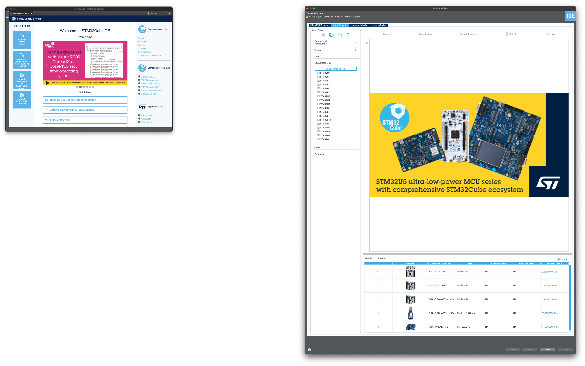
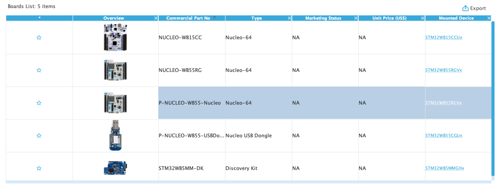
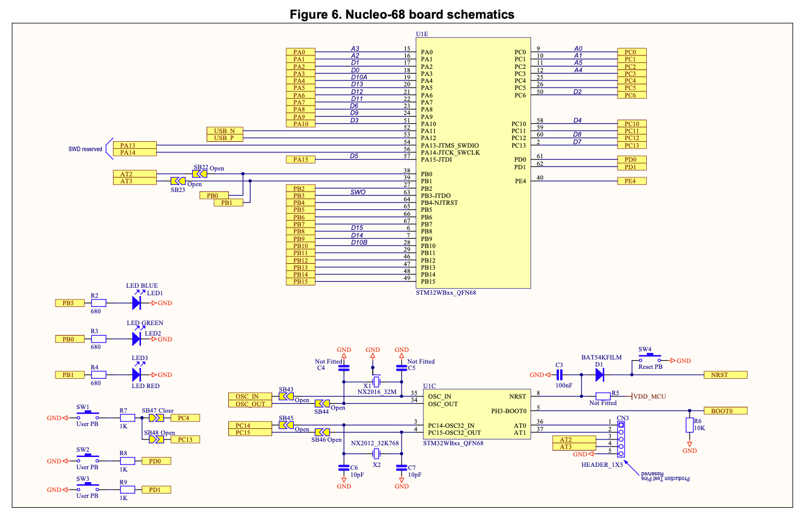
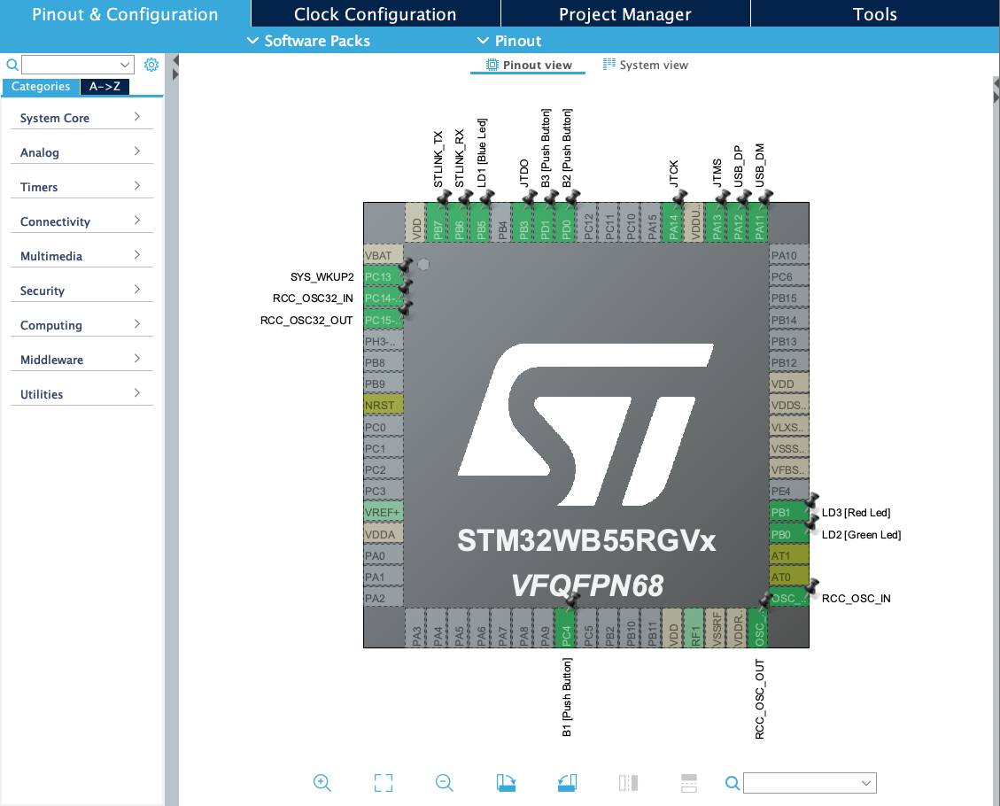
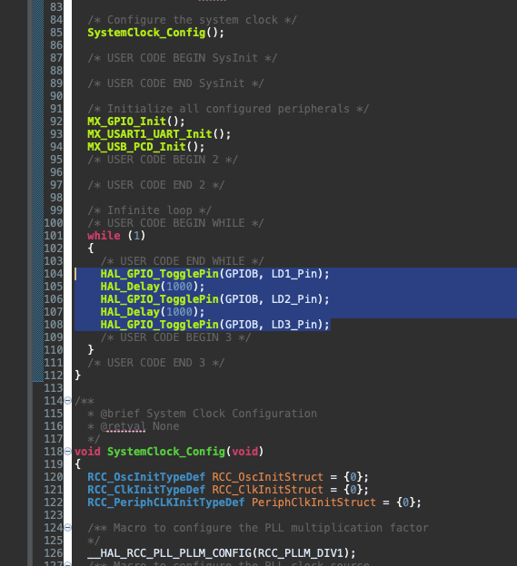
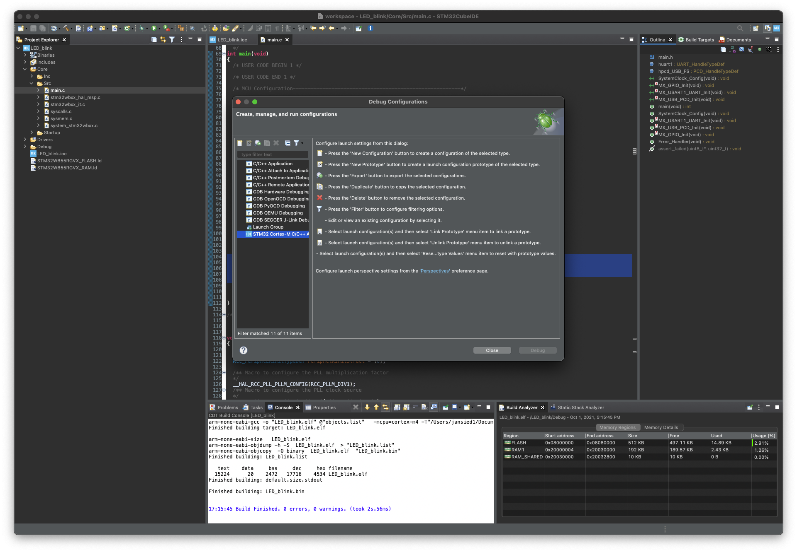
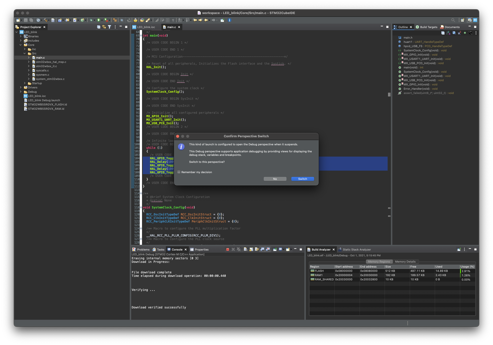
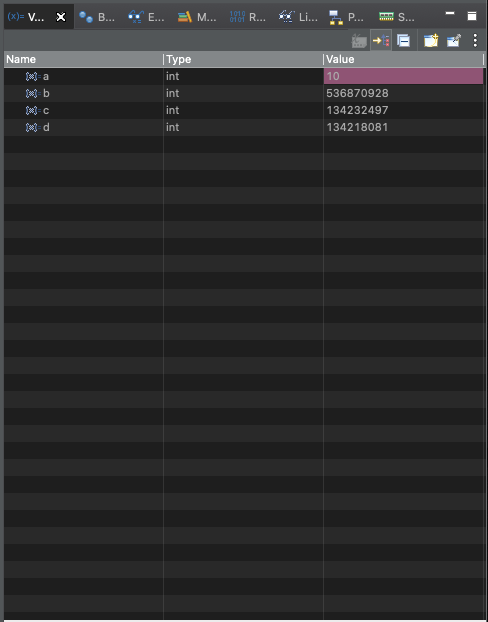

# Laboratory 3

This lab is worth 40 points.  Make sure to include the bold questions and your answers to those questions in your report.

## Introduction
You have been working with the **STM32CubeIDE** editor and debuggers.  All of this has been emulated through QEMU.  Unfortunately, if you check the the xPack website, you'll see that the STM32WB55 board, which is the board that was shipped to you, is not supported.

This is OK, because we are going to use the board to do some simple tasks like lighting an LED and throwing a switch.  The debugging will happen directly in the IDE and the board.  We can step through the program *on the board*.
 
## Parts List
P-NUCLEO-WB55 Board (not the dongle)
(1) USB to micro-USB cable


## Procedure

### Experiment 1

#### Claiming Your Repo

1.  Make sure you've accepted the classroom link and your repository for Lab 3 [here](https://classroom.github.com/assignment-invitations/5fa756889e3d4c755173136e2485e7af).
2. Clone your repo to your laptop.

#### Install STM32CubeProgrammer

We can upload and debug programs directly in the IDE.  However, it's also handy to be able to write code and write it directly to the board and use the board without having it connected to your laptop.  To do this, we need **STM32CubeProgrammer** from ST.com.  You should navigate to [this](https://www.st.com/en/development-tools/stm32cubeprog.html) webpage and download STM32CubePrg for your machine.  You may need the login you created in Lab 1 at ST.com to download the package.  Install the package.

NOTE:  For Mac users, the only way I was able to install the package was to go into the Application Package and run the script directly:  `./en.stm32cubeprg-mac_v2-8-0_v2.8.0/SetupSTM32CubeProgrammer-2.8.0.app/Contents/MacOs/SetupSTM32CubeProgrammer-2_8_0_macos`.  If you have Gatekeeper activated, it will (of course) reject the code.  Go into `System Preferences > Security & Privacy` and on the `General` tab there will be a button to `Open Anyway`.  Click there and it should run the installer.

#### Start A New Project

1. Open up `STM32CubeIDE` and point the workspace to your new repo workspace.  It should be something like `laboratory-3-your-name-here/workspace` (Mac/Linux) or `laboratory-3-your-name-here\workspace` (Windows). 

> **_NOTE:_**  From here on, I will use Unix-like directory structures.  Windows users will know to substitute `\` for `/`.

2. Go to `File > New > STM32 Project`
3. In the project window, click on the `Board Selector` tab.
4. In the list to the left, click on `STM32WB`.  Several boards will appear at the bottom of the window.




5. Select `P-NUCLEO-WB55-Nucleo` and click `Next >` at the bottom of the window.
6. Under `Project Name` put `LED_blink`.
7. You will be asked `Initialize all peripherals with their default Mode?`. Select `Yes`.
8. Select `Yes` to open to that perspective.

#### On-Board LEDs

There are several LEDs onboard the WB55.  We will program these to toggle with some delay in between.  You will find the [UM2435 User Manual](pnucleowb55.pdf) to be helpful.

The schematic for part of the board can be found in Figure 6 of the User Manual:



We will be interfacing with the BLUE, GREEN, and RED LEDs.  They are on the left side of the schematic.  As you can see they are part of GPIOB.  This can also be seen in the pin out in the IDE:



#### Edit `main.c`

Go to `main.c` by looking the Project Explorer on the left side of the IDE.  As a reminder, it's in `Core > Src > main.c`.

In the "Infinite Loop" block of `main.c`, insert the following code:

```
	HAL_GPIO_TogglePin(GPIOB, LD1_Pin);
	HAL_Delay(1000);
	HAL_GPIO_TogglePin(GPIOB, LD2_Pin);
	HAL_Delay(1000);
	HAL_GPIO_TogglePin(GPIOB, LD3_Pin);
```

It should look something like this:



Go to `Project > Build All`.  This will compile your code.  You should have no errors or warnings.  If you do, correct and try again.

#### Connecting Your Board

Take your STM32WB55 board and look at the bottom of the board.  You'll see two things of note.  First, you'll see that there are several pin outs that are unshielded.  **DO NOT PLACE THE BOARD ON ANYTHING CONDUCTIVE.**  You may want to put the board on a cardboard box or some other non-conductive material.  Avoid cloth, as it can store static electricity and can fry parts of the board.  You might use an non-conductive bag like what electronics are shipped in.

Second, you'll see two USB ports:


Connect your USB cable to the one labled `ST-LINK`.

Plug your board into a USB port on your laptop.  If your laptop only has USB-C ports, you'll need an adapter.

At this point, you'll see the board light up and the COM light will blink a bit.

#### Debugging Your Program

Open `Run > Debug Configurations` in the IDE.  You'll see a list of different types of configurations.  We want the `STM32 Cortex-M C/C++ Application`.  Select that and then press the `New Configuration` button (the white block with the yellow plus at the top left).



You should now have a `LED_blink Debug` profile under the `STM32 Cortex-M C/C++ Application`.  Press `Debug` at the bottom of the window.

The IDE will attempt to connect to the board.  You should see this window if all goes well:



Press `Switch`.

You should now be in the debugger.  It should be stopped at `HAL_Init();`.

Slowly step through each instruction with the `Step Over (F6)` button.  When you get to the `HAL_GPIO_TogglePin(GPIOB, LD1_Pin);` instruction, you should see the BLUE LED light.  Step through all of the instructions once.  All of the LEDs (BLUE, GREEN, RED) should all be lit.  Now, step through the loop again.  Each of the lights should go out.  Now, press the `Resume` button and let the program run freely.  You should see the lights light up and go out in sequence.  Stop the program.

#### Add Code

There is a delay statement missing.  Put it in after the last `TogglePin` instruction.  **What happens?**

#### Commit your code

Commit your code to your repository.

Close that project in the Project Explorer.

### Experiment 2

Go to `File > New > STM32 Project`.  Create a new project called `computation` in your workspace.  Do everything you did above to get to `main.c`.  In the infinite loop, assign two variables, `a` and `b` as integers.  Assign `a = 10` and `b = 30`.  Create a new variable, `c` that is the addition of `a` and `b`.   Create another variable `d` that is the multiplication of `a` and `c`.

Compile your code by going to `Project > Build Project`.

Now, start the debugger and step through this code on your board.  In the upper right, you should have a window that contains the variables:



In this image, `a` has been executed, but `b`, `c`, and `d` have not, so those memory locations have junk in them.  That is, they have been allocated, but not initialized.

Take a screenshot of the variables after you have executed all of the instructions in the loop.  Include it in your lab report.

The other tabs in that window are `Breakpoints`, `Expressions`, `Registers`, `Live Expressions`, `Peripherals`, and `SFRs`.  You can see the state of the board while you are debugging.


## Report
